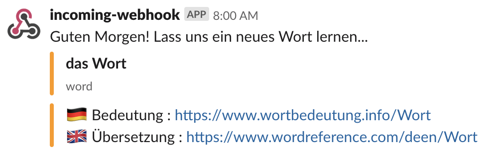

# Slack Speaks German

AWS Lambda which notifies Slack with a German word, its article, its English translation, and some links to know more about it.



## Prerequesites

1. [Node.js](https://nodejs.org/en/) (version 14+)
1. [AWS cli](https://aws.amazon.com/cli/) (version 1.18+)

## Usage

```bash
# Run the tests
make test

# Build
make build
```

## Deploy to AWS Lambda

The deploymnent is using AWS Cloud Formation to deploy the AWS Lamda.

The code will be published in a S3 Bucket.

The following command assumes that `aws cli` is authenticated and has all the required permissions to create the required resources.

```bash
    BUCKET_NAME="BUCKET-NAME" \
    BUCKET_KEY="PREFIX-PACKAGE-NAME" \
    WEBHOOK="SLACK-WEBHOOK-URL" \
    make deploy
```

Other parameters are available :
* `SCHEDULE_STATE` (default = `DISABLED`) : enables or disables the schedule
* `SCHEDULE_EXPRESSION` (default = `cron(0 7 ? * MON-FRI *)`) : expression of the schedule
* `ROLE_PERMISSIONS_BOUNDARY` (default = none) : if needed, specifies a permissions boundary to the role
* `RESOURCES_PATH` (default = `/`) : defines a path to the role and the policy
* `TAG_TEAM` (default = `undefined`) : value of the tag `Team` applied to the resources
* `TAG_SYSTEM_ID` (default = `undefined`) : value of the tag `SystemID` applied to the resources
