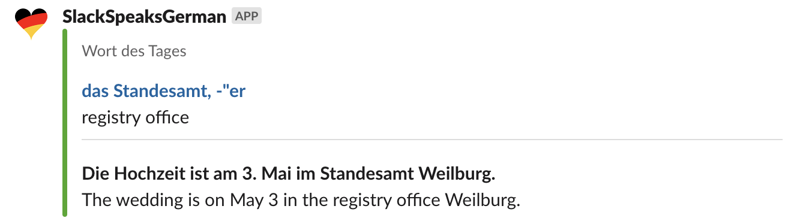
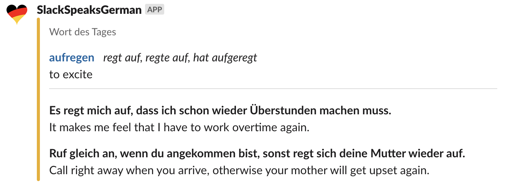

# Slack Speaks German

AWS Lambda which notifies Slack with a German word, its English translation, and some examples.




## Prerequisites

1. [Node.js](https://nodejs.org/en/) (version 14+)
1. [AWS cli](https://aws.amazon.com/cli/) (version 1.18+) in order to deploy

## Usage

```bash
# Run the tests
make test

# Send a word to a Slack from local (test purposes)
WEBHOOK=https://hooks.slack.com/services/AAAAA/BBBBBB/CCCCCCCCCC make run
```

## Deploy to AWS Lambda

AWS Cloud Formation is used to deploy the AWS Lambda.

The code will be published in a S3 bucket, also - before trying to deploy - make sure you have a S3 bucket available ([see official documentation to create a bucket](https://docs.aws.amazon.com/AmazonS3/latest/userguide/create-bucket-overview.html)).

The following command assumes that `aws cli` is authenticated and has all the required permissions to create the required resources.

```bash
    BUCKET_NAME="NameOfTheBucket" \
    BUCKET_KEY="NameOfTheFileInTheBucket" \
    WEBHOOK="SlackWebHookURL" \
    make deploy
```

Other parameters are available :

|Parameter|Default|Description|
|-|-|-|
SCHEDULE_STATE|`DISABLED`|enables or disables the schedule|
|SCHEDULE_EXPRESSION|`cron(0 6 ? * MON-FRI *)`|expression of the schedule (UTC timezone)|
|ROLE_PERMISSIONS_BOUNDARY|none|if needed, specifies a permission boundary to the role|
|RESOURCES_PATH|`/`|defines a path to the role and the policy|
|TAG_TEAM|none|value of the tag `Team` applied to the AWS resources|
|TAG_SYSTEM_ID|none| value of the tag `SystemID` applied to the resources|
